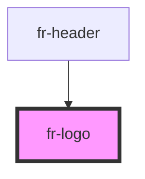

# fr-logo

<!-- Auto Generated Below -->

## Properties

| Property | Attribute | Description                                                                                                                 | Type      | Default     |
| -------- | --------- | --------------------------------------------------------------------------------------------------------------------------- | --------- | ----------- |
| `large`  | `large`   |                                                                                                                             | `boolean` | `undefined` |
| `small`  | `small`   | Global size of the logo with the Marianne and the french motto The default size is medium and does not need to be specified | `boolean` | `undefined` |

## Dependencies

### Used by

 - [fr-header](../header)

### Graph

----------------------------------------------

*Built with [StencilJS](https://stenciljs.com/)*
